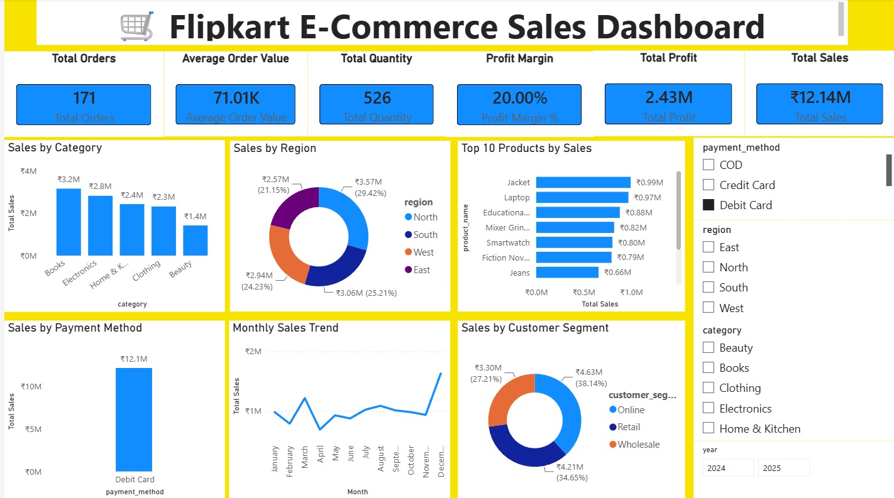

# Flipkart E-Commerce Sales Analysis

> End-to-end data analytics project focused on sales performance, profitability, product trends, regional performance, customer segments, and payment methods.

## Overview

This project analyzes Flipkart e-commerce sales data to identify key business trends and performance indicators. The workflow covers data preparation and validation in Excel, SQL-based analysis using PostgreSQL, and interactive business intelligence reporting in Power BI.

The project demonstrates an end-to-end analytics workflow from raw data preparation to business insights and dashboard reporting.

## Business Objectives

- Evaluate overall sales and profitability
- Analyze profit margin and key performance indicators
- Identify top-performing products and categories
- Compare sales performance across regions
- Analyze customer segment performance
- Evaluate payment method contribution
- Identify monthly and quarterly sales trends
- Perform data quality and validation checks
- Support business decision-making through interactive reporting

## Technology Stack

| Tool | Purpose |
|---|---|
| **Microsoft Excel** | Data cleaning, validation, pivot analysis |
| **PostgreSQL** | SQL analysis, data validation and business queries |
| **Power BI** | Data modeling, DAX measures and interactive dashboard |
| **Power Query** | Data transformation and preparation |
| **DAX** | KPI calculations and analytical measures |

## Key Performance Indicators

The dashboard tracks:

- **Total Sales**
- **Total Profit**
- **Total Orders**
- **Total Quantity Sold**
- **Average Order Value**
- **Profit Margin**

## Analysis Performed

### Sales & Profitability
- Total sales and profit analysis
- Average order value
- Profit margin analysis
- High-value and high-profit orders

### Product Analysis
- Top products by sales
- Top products by profit
- Top products by quantity sold
- Product revenue per unit
- Product-level customer ratings

### Category Analysis
- Sales by category
- Profit by category
- Quantity sold by category

### Regional Analysis
- Sales by region
- Profit by region
- Quantity sold by region
- Regional customer ratings
- Regional profit margins

### Customer Analysis
- Sales by customer segment
- Profit by customer segment
- Quantity sold by segment
- Customer ratings by segment
- Segment-level profit margins

### Payment Analysis
- Sales by payment method
- Profit by payment method
- Quantity sold by payment method
- Customer ratings by payment method
- Payment-method profit margins

### Advanced SQL Analysis
- Product and regional ranking
- Top-performing regions
- Orders above average sales
- Top products within each region
- Running total sales
- Best-performing product by category
- High-profit orders

## Power BI Dashboard

The interactive dashboard provides a consolidated view of sales, profitability, product performance, regional performance, customer segments, payment methods, and monthly sales trends.



## Project Files

| File | Description |
|---|---|
| `flipkart_sales_cleaned.csv` | Cleaned dataset used for analysis |
| `Flipkart_Ecommerce_EXCEL_Analysis.xlsx` | Excel-based analysis and dashboard |
| `Flipkart_Ecommerce_SQL_Analysis.sql` | SQL analysis and business queries |
| `Flipkart_Ecommerce_PowerBi_Analysis.pbix` | Interactive Power BI dashboard |
| `dashboard.png` | Dashboard preview |

## Key Skills Demonstrated

- Data Cleaning & Preparation
- Data Validation
- SQL Query Development
- PostgreSQL
- Excel Analysis
- Power Query
- Power BI
- DAX
- Data Visualization
- KPI Reporting
- Business Intelligence
- Trend Analysis
- Analytical Problem Solving

## Project Workflow

```text
Raw / Cleaned Data
        ↓
Microsoft Excel
(Data Cleaning & Validation)
        ↓
PostgreSQL
(SQL Analysis & Business Queries)
        ↓
Power BI
(Data Modeling & DAX)
        ↓
Interactive Dashboard
        ↓
Business Insights
